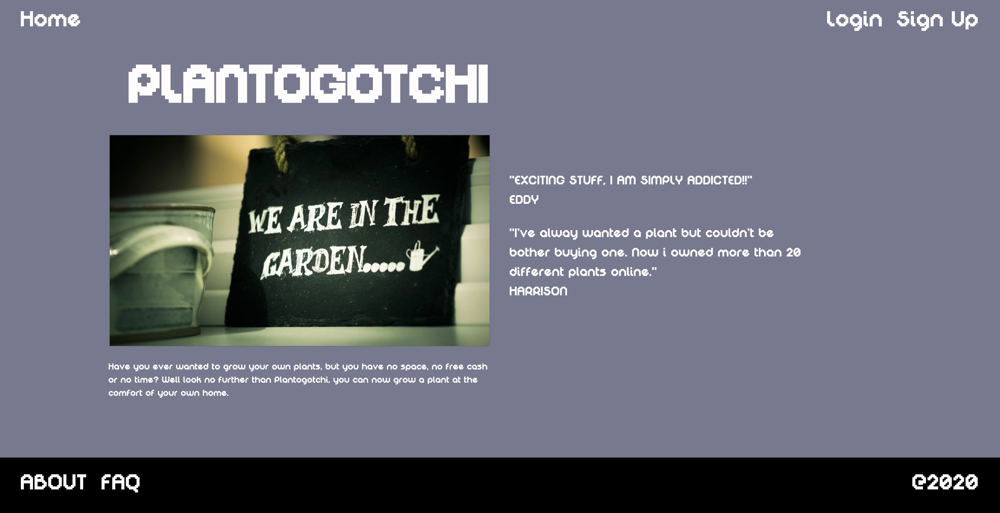
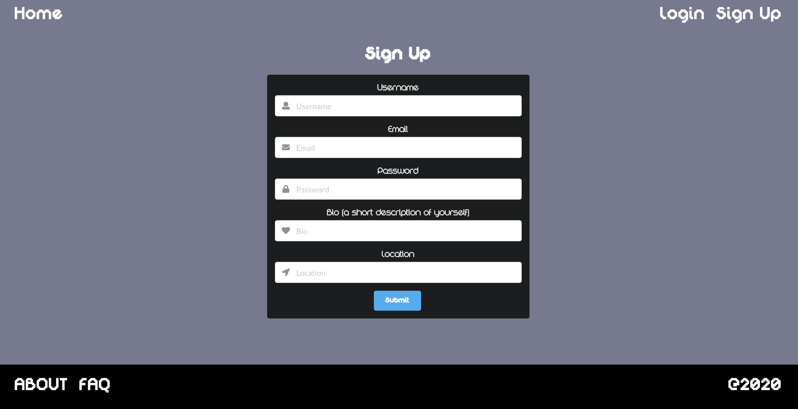
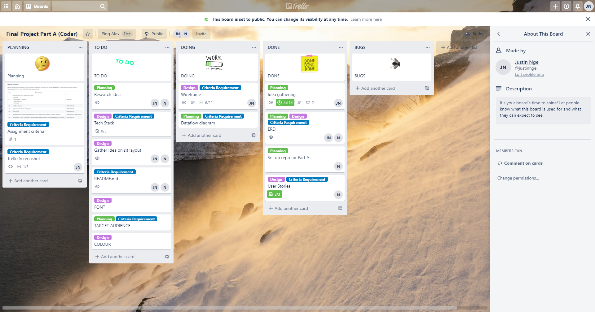
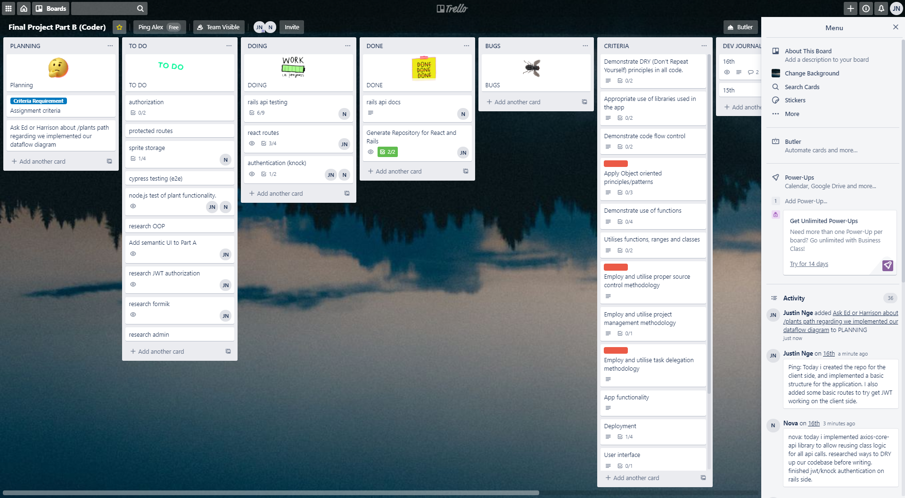
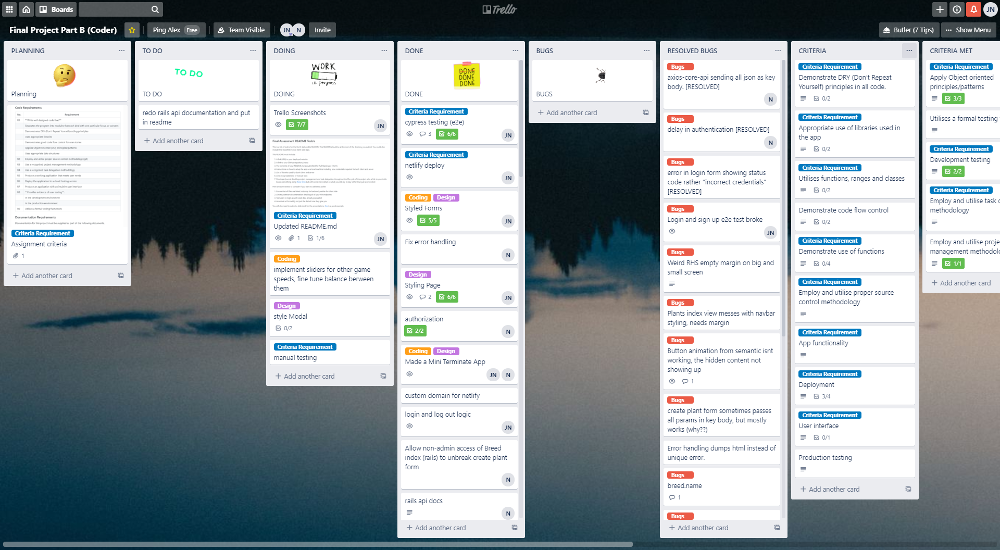

RPlantogotchi

## Table of Contents:

---

| #   | Content                                                               |
| --- | --------------------------------------------------------------------- |
| 1   | [The Project](#the-project)                                           |
| 2   | [Installation Guide](#installation-guide)                             |
| 3   | [Functionality / features](#functionality--features)                  |
| 4   | [Target Audience](#target-audience)                                   |
| 5   | [Tech Stack](#tech-stack)                                             |
| 6   | [Dataflow Diagram](#dataflow-diagram)                                 |
| 7   | [Application Architecture Diagram](#application-architecture-diagram) |
| 8   | [User Stories](#user-stories)                                         |
| 9   | [Design](#design)                                                     |
| 10  | [Wireframe](#wire-frames)                                             |
| 11  | [Screenshots](#screenshots)                                           |
| 12  | [Testing](#testing)                                                   |
| 13  | [Task Management](#task-management)                                   |


## The Project

---


This is a team project created for the final assessment during the Coder Academy bootcamp. For this assessment we had one week for planning and less than two week to code. We had to create a React App with a Ruby on Rails backend.

Plantogotchi took inspiration from Tamagotchi giving users the ability to grow plants from a little seedling to a fully grown plant.

Netlify - https://plantogotchi.netlify.app

Heroku Api Backend - https://documenter.getpostman.com/view/11888283/T17Q6k6B?version=latest

### Purpose

---

The purpose of this web application is mainly designed for leisure, it was created for anyone who enjoys gardening but lacks the space or time to take care of real plants. The main objective of this application is to allow users to take care of a virtual plant in a Tamagotchi style environment. The users will able to grow a range of different plants for the sake of entertainment or to improve mental health during these difficult times.

#### Current Problem

The current COVID-19 global pandemic has had a significant impact on our society as people are being forced into lock-down restrictions that see them losing their jobs or unable to see their friends or loved one, all of which have a huge negative impact on their mental health. An [article](https://www.sahealth.sa.gov.au/wps/wcm/connect/f584ac43-db54-44d5-a5df-82c6415f18d7/20200501+Mental+Health+and+COVID-19+Fact+Sheet+-+Information+for+the+com....pdf?MOD=AJPERES&amp;CACHEID=ROOTWORKSPACE-f584ac43-db54-44d5-a5df-82c6415f18d7-n7t8sdk) from the South Australian government has detailed a list of impacts on the mental well-being of people during this difficult time. 

Plantogotchi was created as a simple web application that allow users escape from the stress they may face during the COVID-19 pandemic by providing them with something easily accessible, with their only barrier to the applictation being internet access and possession of a computer device. Studies have shown the [benefits](https://www.thesill.com/blogs/care-miscellaneous/why-you-need-plants-in-your-life) of having indoor plants. Although Plantogotchi is virtual plant game, we aim to provide our users with similar benefits.

Source:
- https://www.thesill.com/blogs/care-miscellaneous/why-you-need-plants-in-your-life
- https://www.sahealth.sa.gov.au/wps/wcm/connect/public+content/sa+health+internet/conditions/infectious+diseases/covid+2019/coronavirus+disease+2019+covid-19


## Installation Guide

---

Please clone Plantogotchi from the following repository:

React Front-end repository - https://github.com/ping-n/plantogotchi-client

React Back-end repository - https://github.com/novacoole/plantogotchi-api

### Front-end installation

---

1: Clone the this [repository](https://github.com/ping-n/plantogotchi-client) through git or download as a zip file

For front-end repo, please run the following commands from the root folder of the repository through a cli of your choice.

Run yarn install to install on the dependencies for this react app
```
yarn install
```

2: You will need to create a .env file in your root folder for this repository and add the following codes inside your .env file.

Add codes below to .env:

We have chosen to use port 3000 for our rail api, if you are working on a different port then change the number accordingly. The PORT variable tell our local react server that start on port 8080.
```
REACT_APP_BACKEND_URL=http://localhost:3000
PORT=8080
```

3: You can now start the react server using the following command through your cli.

```
yarn start
```

This will load the React front-end of Plantogotchi in a new tab of your default browser. You will now need to install the back-end of the application for the full experience.


### Back-end installation

---

1: Clone the this [repository](https://github.com/novacoole/plantogotchi-api) through git or download as a zip file

2: For the back-end repo, please run the following commands from the root folder of the repository through a cli of your choice.

3: This application require an installation of PostgreSQL to run which can download from the following -https://www.postgresql.org/download/

Run the following commands in the order listed below:

Install rails dependencies
```
bundle install
```
You will need to delete the credentials.yml.enc at the following path 'config/credentials.yml.enc'

After that you will need to generate a new master key so that knock generate jwt token for user authentication

4: Please run the following command to generate a new master key
```
EDITOR="code --wait" bin/rails credentials:edit
```
5: Create a new database in PostgreSQL
```
rails db:create
```
6: Create the schema for database
```
rails db:migrate
```
7: Seed the database with different plants breed and test users
```
rails db:seed
```
8: Start the rails server
```
rails start
```

The back-end server will need to be running alongside the front-end server to enjoy the intended experience of Plantogotchi.

##### Cors

By default the following URLs are whitelisted in the CORS configuration file:

* 'http://localhost:3000'
* 'http://localhost:3001'
* 'http://localhost:8080', 
* 'https://plantogotchi.netlify.app'

If you plan on running the client-side server on a different port, you will need to manually add this localhost URL to the '/config/initializers/cors.rb' file.

##### Rspec

You can run the RSpec suite tests by running the following command in your terminal within the root directory of the ''/plantogotchi-api' repository.

```bash
bin/rspec
```

##### Testing API with Postman

[Our Postman documentation](https://documenter.getpostman.com/view/11888283/T17Q6k6B?version=latest) outlines how to hit all the accessible endpoints of our API both locally and in production.

### Testing Information

---

Test Users 

| #                | Users          | Password |
| ---------------- | -------------- | -------- |
| 1 (Admin User)   | admin@test.com | password |
| 2  (Normal User) | test@test.com  | password |

- Admin user will have the ability to create new breeds and perform CRUD on plants and breeds. Admin User will also have access to sliders to control element of the application.
- Normal user will only have the ability to create new plants and interact with their plants.

Seed Data

* There are also 10 additional seed users, with 5 plants (random breeds) each. These are to help the test user visualise the admins /plants dashboard with a proper user-base.


## Functionality / features

---

* Ability to plant a seed/create a new plant.
* Ability to monitor the plant's health.
* Ability to water (or fertilise) the plant if necessary.
* Plant grows over time if health is maintained.
* Plants dies if left without maintenance.
* For every plant that reaches the final stage of growth, the user is allowed to create one more plant.
* User profile displays user's name, bio and plants.
* User account page where details can be changed, password reset.

#### Future feature

* A shop within the application that allow to user to purchase rare plants, fertiliser or other boosts to gameplay such as an automatic watering can.
* Level system which allow user progression, for example; to unlock new plants or abilities.
* Allow users to collect badges/achievement from progressing through the web application.
* A page for the user to show off their collection to other users.
* Comments or chat functionality to allow the user to connect with other users.

## Target audience 

---

Plantogotchi to designed for any person interested in gardening, particularly those who lack the resources to garden non-virtually. As outlined in our user stories, the application may be particularly useful to those looking for some form of virtual companionship, or those wanting to experience giving care. Plantogotchi would be a great application for children as it may teach them the responsibilities that come from taking care of another life form. It would make a great introduction application for children whose parents wish to find out if the child is responsible enough to own a real plant or a real pet. Other than children, Plantogotchi will also appeal to adults who love gardening but lack the time or resources to invest in a real plant. 

User will have the ability to grow different type of plants. As their profile levels up, more varieties of plants will be unlocked which enable a sense of progression within the application. Plantogotchi's simple gameplay means that the elderly can easily pick up the application and play on their phone, giving them the ability to play with their grandchildren over the internet, especially within this global pandemic which prevents them from interacting with their grandchildren in real life due to the elderly being more susceptible to catching the virus. Applications like Plantogotchi may be helpful for them to connect with family members and hopefully alleviate some of the stress that they have accrued over such a difficult time.

As Plantogotchi expands, we hope to add features such in-game chat or a comments system to allow people to connect or play with their friends and families. This feature will be our main focus straight after we launch the first playable version of Plantogotchi as we feel that these features will be great for the community to have as another avenue to make friends in such stressful time. 

## Tech stack

---

Back-end Framework

- Ruby on Rails

Front-end Framework

- React

Database

- PostgreSQL

Version Control

- Git & Github

Deployment Services

- Heroku
- Netlify

Project Management Tools

- Trello
- Discord


| #   | Component                                                                                                                                                      |
| --- | -------------------------------------------------------------------------------------------------------------------------------------------------------------- |
| 1   | Ruby on Rails: Back-end of the web application, enable the web application to have a persistence of data.                                                      |
| 2   | HTML5 & CSS: To output the application content in the browser while providing the ability to style pages of the web application.                               |
| 3   | React.js: A JavaScript framework that allows the creation of quick and powerful client-side web applications.                                                  |
| 4   | Node.js: A JavaScript runtime environment which allows JavaScript code to run outside the web browser, such as on a server.                                    |
| 5   | Heroku: A deployment platform for the web application which hosts our back-end (Rails API) and persistent database.                                            |
| 6   | Netlify: A deployment platform to host the front end of web application (React).                                                                               |
| 7   | PostgreSQL: A relational database management system to hold all of the persistent data from the web application.                                               |
| 8   | Git: Version control to backup source code of the application in local environment.                                                                            |
| 9   | Github: Web repository hosting service, which allow members within the team to collaborate on the project as well as providing a remote backup of source code. |
| 10  | Trello: A web application that allow team members to manage the project by creating and assigning tasks.                                                       |
| 11  | Discord: An application for instant messaging and VoIP service. We use discord to communicate ideas and hold daily stand ups.                                  |


## External Library

---

### Front-end Library


| #   | Library                                                                                                                                                                                                                                  |
| --- | ---------------------------------------------------------------------------------------------------------------------------------------------------------------------------------------------------------------------------------------- |
| 1   | Axios: Promised based HTTP client for the browser and node.js which allow us to make HTTP request to our rails api                                                                                                                       |
| 2   | Semantic-ui-React: Component based semantic ui integration with React, allow us to follow add semantic styling to our project by using semantic ui component.                                                                            |
| 3   | Semantic-ui-css: Allow us to import the css styling from semantic ui, we are using a less version which give us more control over semantic ui default styling.                                                                           |
| 4   | Node Sass: Node-sass is library that bind Node.js to Libsass, which allow us to write scss codes in this project as it automatically compile scss into css.                                                                              |
| 5   | React-router-dom: React router dom allow us to create a single page application for this project as it load section of the webpage so it render instantly without having to reload the page each time the interact with the application. |
| 6   | Rsuite: We use React suite to implement the admin sliders for control different aspect of the application such water drop rate, plant growth rate etc.                                                                                   |
| 7   | Cypress: Cypress was used for E2E testing, which allow us to simulate the user experience via having a bot testing element of the application.                                                                                           |
| 8   | Testing-library: Testing library provide us with the tools to write tests for this application through Mocha and Chai                                                                                                                    |
| 9   | Craco: We use craco in order to edit semantic ui variable, creating configuration to make a custom semantic theme for our application                                                                                                    |
| 10  | Test-data-bot: We use this library for our e2e testing as it allow to generate fake data for cypress to do automated testing                                                                                                             |

### Back-end Library

| #   | Library                                                                                                                                                                                                           |
| --- | ----------------------------------------------------------------------------------------------------------------------------------------------------------------------------------------------------------------- |
| 1   | Rubocop-rails: A [RuboCop](https://github.com/rubocop-hq/rubocop) extension focused on enforcing Rails best practices and coding conventions.                                                                     |
| 2   | Aws-sdk-s3: AWS S3 SDK for Ruby, allows Ruby/Rails to integrate easily with a AWS S3 Bucket.                                                                                                                      |
| 3   | Rspec-rails: Allows us to integrate the RSpec testing framework into rails. Provides many helper methods and internal libraries for writing automated tests.                                                      |
| 4   | Shoulda-matchers: Providers one-liners that plug-in to RSPec or Minitest. Simplifies writing tests and reduces chance of writing broken tests.                                                                    |
| 5   | Database_cleaner: A set of gems that allows us to clear/reset out database during tests as to not effect our development/production databases and to avoid cross-contamination of database entries between tests. |
| 6   | Simplecov: A code coverage analysis tool for Ruby, allows us to easily/automatically find out what percentage of our codebase is being tested and gives insight into specific areas requiring more attention.     |
| 7   | Knock: We used knock gem in our application for user authentication via JWT token                                                                                                                                 |


## Dataflow Diagram

---


## Application Architecture Diagram

---


## User Stories

---

### **Barbara**

Barbara lives a solitary existence, trapped in a small, damp and mold-ridden room of the West Maribyrnong "Keep 'Em Till They Kark It" retirement village. She spends most of her days sitting in her worn floral armchair peering out into the village's pitiful garden, reminiscing of her youth spent elbow deep in the soil of her father's potato farm. Years pass like this until one day, during one of her annual visitations, her grandson shows her a web application on his phone; Plantogotchi. 

At first, she does not quite make out the strange green hue emitting from the grandson's mobile telephone, but upon fitting her 26x prescription glasses she finally makes out a small flower sitting in a pot. At once, her years of depression fade away and she is overcome with joyous ecstasy. A blinding white light breaks through the dark clouds above and shoots down onto the phone. She knows at once what she must do, and grabs the phone from her grandson's hand. "GET OUT OF HERE!" she screams at him as he cowers in the corner, before he runs out the door. 

She relaxes back into her floral armchair and notices the plant looks a little brown and withered, and thinks to herself "my baby needs some water", content with her new-found friend.

### **Richard**

Richard is a busy man. After recently taking a promotion at Phillip Morris International, he has been completely inundated with work surrounding the several million lawsuits the company is facing for misrepresenting the dangers of tobacco use. No matter, Richard keeps on top of things by disregarding all other facets of life and by consuming 750mg of caffeine daily. Richard is a workaholic.

Recently, Richard has been having strange, unnatural feelings; The need to care for something. At first he considered buying a pet, but that would ruin his pristine penthouse apartment and require going to a grocery store, which he **hates** doing. He considered growing a plant, before he realised that would likely involve having soil in house, a common host for mycotoxin-emitting micro-organisms, that would not do.

One day, while scrolling through his Golf Club's Facebook feed, he notices a well-composed marketing campaign for a web application; Plantagotchi. "This app is free?! Rookies!". He downloads the app on-the-spot and starts growing a small cactus. He likes looking at it so much, that he buys an extra LCD monitor just so he can watch his plant grow while he works.

#### Barbara and Richard's Stories

- As a user, I want a simple/intuitive user interface, so that I can start caring for my plant immediately without the need for training.
- As a user, I want multiple breeds of plant to choose from, so that the game remains interesting for me over time.
- As a user, I want to have an account, so that I can keep my progress and change my details.
- As a user, I want to have a profile, so that I share my plants with friends.
- As a user, I want to have to have third-party authorization, so I can make an account quickly without a new password to remember.

---

### **Ping**

Ping is the admin (and creator) of Plantagotchi. He cares about his users, and wants to make sure his applications runs smoothly. While he has done extensive testing before releasing the app, you can never be too careful and thus he creates admin functionality to maintain the software and resolve any issues or bugs that may arise.

#### Ping's stories

- As an admin, I want to have full rights to create, update, delete or destroy plants, so that I can test and maintain the database.
- As an admin, I should have the ability to moderate user progress and help users with any queries they may have.
- As an admin, I want to have the ability to reset user's passwords, so that I can assist users who lock themselves out.
- As an admin, I want the ability to control the speed of the game, so that I can easily debug it without waiting for hours.

## Design

---
The initial inspiration of Plantogotchi come from the old-school Tamagotchi handheld device that we owned growing up, which taught us to be responsible by feeding and taking care of a virtual pet. We had a lot of fun playing with Tamagotchi as children so we wanted to re-create that theme but incorporate our hobbies as adults. The theme of Plantogotchi is to create a retro aesthetic application by incorporating pixel font and utilising pixel art to represent our plants. The main functionality of our web application is caring for and growing plants, therefore we wanted to make sure these features are included in our MVP while keeping other features relatively simple and straight forward.


The Mood board below represent our initial thought process when choosing the design of our application:


It mainly includes inspiration we found regarding Tamagotchi and pixel art from games that can use as inspiration in our application.

#### Font

We wanted the font to represent the style of a pixel-art game so we found a range of pixel fonts that best represent the theme we are trying to achieve.

Digital Disco font is the font that we decided to go for in the mock up which is why it is used in the wire frames. We believe that the Digital Disco font is really easy to read and the clean pixel design perfectly matches what we want for the web application in terms of accessibility and aesthetic. 


The LL Pixel font leans heavily toward pixelation. We liked the initial look but felt it may shift the attention of users away from the game play of the web application.


Pixel Bug font really stands out, it is unique and fun to look it. The main problem we had with Pixel Bug is that it can be difficult to read on mobile devices and may shift the focus of users away from the other functionality of the application.


Source:
- Digital Disco: https://www.dafont.com/digital-disco.font
- Pixel Bug: https://www.dafont.com/pixel-bug.font
- LL Pixel: https://www.dafont.com/llpixel.font

#### Colour

The colour palette below was generated by inverting the three most dominant colours within the sprites of our plants. A main objective of Plantogotchi is allow user to customise the colour of their user interface to create a web application that can reflect their personality. Hopefully this makes users more invested in our application. The final goal of our application is to allow our user to choose their own background however the freedom of user choice can create different problems. Giving user the choice to choose colour combinations may result in the UI being harder to read because they might choose an unsuitable colour combination that lacks contrast resulting in other features of the application being highly unreadable. To counter such a problem, we came up with the solution of limiting the colour choices by offering only inverted colour to the user, this means any colour the user can choose will not have a negative effect of the readability of the plant itself (the core feature of the application).

These colours are the inverted colours of our three starter plant sprites, ultimately we want to create an application with a fun and soothing environment for the user.


### Site Map

Below is a basic site map of the application:


### ERD

The ERD represents the relational relationship of different model tables within the database. Plantogotchi is a relatively simple web application therefore we wanted to design the database in a simple way to represent all aspects of the application.

User:
- The user model will hold all information regarding the user such as username, email and password.

Plant:
- The Plant model will hold data regarding the plants and it is therefore crucial to the main functionality of the application.
- The 'water_level' and 'food_level' attributes will represent the growth logic of the plant, if the water and food level is sufficient then the plant will grow to the next stage.
- The 'alive' boolean attribute allows the application to quickly check whether the plant is alive without doing calculations with other attributes. If the plant is dead then information will need to be conveyed to user through the front-end framework, and functionality of that particular plant will be disabled.
- The 'growth_stage' attribute is an integer to represent the growth stage for a particular plant type in comparison to the 'max_growth' of that plant's breed. This comparison allows us decide which sprite to render for the plant, which will represent the plant's growth visually to the user.

Breed:
- This will hold all information regarding the different type of plants available.
- Being in separate tables allow us to scale the application in the future by add more breeds or plant types.
- The max_growth field is integer representing the total stages of growth for that plant, which is dependant on the number of growth sprites available for a given breed.

Event:

* This table will hold all the events, or user interactions that may impact the plant's growth.

* The 'type' attribute' is represented as an enum to allow us to expand the database in the future. Using enum attributes is flexible and allows us to use less data space to identify what type of user interaction has occurred.

Below is the ERD of the application:


#### Model Relationship

- User and Plant
  - A User has many Plants.
  - A Plant belongs to one User.
- Plant and Breed
  - A Breed has many Plants.
  - A Plant belongs to One Breed.
- Plant and Event
  - A Plant has many Events.
  - An Event belongs to One Plant.

## Wire-frames

---

The wire-frames below are a direct draft of the web application's visual layout. The colours represented in the wire-frame do not reflect the final product as we hope to give our user the ability to customise the colours of the background and UI to make the application feel unique for individual user. The wire-frames were designed in Figma, each wire-frame includes three different dimension to represent user accessing the application from a range of different devices.

Size:
Desktop: 1440x1024
Tablet: 834x1194 (iPad Pro 11 inch)
Mobile: 360x640 (Average Android phone size)

#### Landing Page

The landing page will include an animation showing game-play, giving new users a peek at the overall functionality of the web application. There will also be user reviews to attract potential users to sign up and try out our application.


#### Main App Page

This is the main feature of the application which is where the user will interact with their plants. We wanted to design the layout in a way where the plant is the first thing the user sees when they log on. This is why we position the plant directly in the centre of the application, to make sure that the most important data is conveyed to the user quickly, such as the water and growth level bar. In order to make the application fun and enjoyable, our main goal is allow users to interact with the plant quickly and to see all information they need to effectively take care of their plant. 


#### Login/Sign up Page

This is where the authentication process take place, we want to keep these two pages simple and straight forward. This pages will allow users to quickly login or sign up, then get straight into the gameplay loop of the web application. We want to give users the ability to authenticate through their other social accounts such as Google or Facebook in order to shorten the registration process. The presence of Google and Facebook sign-in options will also create a good impression on potential users by giving them the ability to login or sign up with a platform that they already trust.   


#### About Us

A really simple and straight forward page to give the user a brief introduction about the application. The main objective of this page is to entice new users to sign up once they have finished with this section.


#### FAQ

A simple page created to provide users with basic answers to frequently asked questions as well as a contact form which they can fill out to reach the admins/creators of the application. The contact form will make use of the Formspree SaaS, in order to avoid having to store messages in our persistent database. 


### Wire-frame Demo

Below is a demo for the wire-frame, clicking on this [**link**](https://www.figma.com/proto/bPJuz1UPRUSFjCFz4lDSTF/CODER-FINALPROJECT-A?node-id=0%3A3&scaling=min-zoom) will allow you to go through the wire-frame in real time.


### Wire-frame Relationship


Please visit this [**link**](https://www.figma.com/file/bPJuz1UPRUSFjCFz4lDSTF/CODER-FINALPROJECT-A?node-id=0%3A1) to view the wire-frames. Navigate to the prototype tab in Figma will highlight the relationship between each pages in greater detail.

## Screenshots

---

Home Page



About Page


Faq Page


Login Page


Sign Up Page



Tablet Plants


Tablet App Interaction Screen


Mobile friendly


## Testing

---

### Manual Testing

Manual Testing Link - https://docs.google.com/spreadsheets/d/11GDbPEAAhAQs71G6MZy2tKLSG8qsmmroCH1N3hXAQY4/edit?usp=sharing


Manual Testing Client


Manual testing Api


### E2E Testing (Cypress)


### Rspec CI (Git Action)


### Testing Coverage for api (Simple Cov)


A simple coverage zip is attached in the docs folder. [Simple Cov Zip](docs/simplecov-report.zip)

## Task Management

---

This project utilises Trello as a project management tool which allows us to allocate tasks to individual members of the team. We also utilise Discord as a platform to collaborate on this project, allowing us to hold meetings and communicate with each other to effectively resolve issues and allocate new tasks to be completed. During the project we will implement Agile development principles to develop our application by creating an effective road-map and working on the project in a modular process by dividing tasks to into smaller achievable tasks.

We have provided screenshots below to illustrate the progress of the project each day. As a team we have a daily stand-up in which we go through what we have done the previous day and what we plan to do that day. We also allocate each card/task to a specific member to complete each day. Within the Trello board we utilise the built-in features such as colour labels and checklist to effectively plan and delegate tasks through the member assigning system. 

We also kept dev journal within our Trello board for part B to let each member know what the other person worked on that day and also allow us to keep track of tasks that we have accomplished.

Below is the Trello board progress for the project:

Trello Link:

Part A - https://trello.com/b/DdUvzfZU/final-project-part-a-coder

Part B - https://trello.com/b/ohUHrh5w/final-project-part-b-coder

### Part A (Design Phase)

---

Day One:

On Day One we mainly focused on gathering inspiration and delegating the first set of tasks to individual team members according to their strengths and weaknesses. Day one is relatively empty because we spent a huge amount of our time having a meeting to plan out the features of the application, in accordance to the criteria for the project. 


Day Two:

Day Two represents the starting point of the project, we had a quick meeting in the morning to discuss and delegate the tasks for the day. During the meeting we created the ERD as a team (via pair programming) so we both understand the information we need to store for the application. We also spent the entire day planning and setting up the overall objectives to effectively meet the deadline of the project.



Day Three:

Day Three involves starting and finishing off the design elements of the application such as wire-frames, user stories and discussing about the features we need to create in order to meet our MVP for the application. Today we also studied the criteria in more details to ensure we are meeting the requirements for Distinction to High Distinction for the assessment.


Day Four:

Day Four was the designated final day we allocated for Part A of the project as we wanted to prioritise development time to work on Part B. Day four mainly involve proofreading the Readme and adding all relevant details to ensure we met the set criteria of the assessment. We also included attachments within the Trello cards to showcase the tasks we have completed as well as to gather input in regards to what else we needed to include in our documentation. 


### Part B (Building Phase)

---

Day One:

On day one, we started off by planning and talking about the actual logic of our application, defining a road-map and delegated tasks according to our strengths and weaknesses. One person was assigned to the back-end api development and another person established the front-end framework for the application. We also went through the project brief as a team and discuss how we will tackle the project to ensure we meet the project criteria. 



Day Two:

Day Two involve more planning as a team, such as we library we could use to build the application. Alex was assigned the responsibility to work on the back-end, while I set up react structure for the front-end and begin researching library such Formik and Css framework we could use to speed up development time. 


Day Three:

Day Three involves finishing the MVP of the rails api and research on how to implement authentication to our application. As a team we settle on using jwt token as a form of authentication. I worked on implementing the basic route we need to get start. 


Day Four:

Day Four we had our daily stand up and a short meeting where we decided to use semantic-ui-react for styling our application. Alex finished off rails api which give us access to a live database which we can use to start testing out basic user authentication. We implemented JWT token with knock and did more research on how to implement it with the front-end by having protected route.  


Day Five:

Day Five we begin with our daily stand up and delegated each other some tasks. I began cypress e2e testing for our user authentication and static landing page. Alex was tasked with creating the storage for our spritesheets for the breed and started work on the breed form. We also worked on the main logic of our application as a team through pair programming by creating a little terminal app to test our logic and integrate it into our application.


Day Six:

Day Six involved finishing all the CRUD functionalities within our application and begin creating the static html pages. Alex worked on the CRUD for breeds and Plants. I worked on finishing all the static pages such as Home, FAQ and About.


Day Seven:

Day Seven begin with a meeting in the morning to discuss about current state of the application and any last minute feature we should include in our application. Alex begin going our huge bug list on trello and begin debugging. While I worked on styling teh application and finalizing the design of our application and main plant pages.


Day Eight:

Day Eight is all about hitting the MVP for our application. We removed any libraries we wasn't using in the application and deployed to netlify. I changed some styling to make the application responsive on mobile and started manual testing to find any major bugs. Alex started manual testing for the rails api and fixed many of our existing bugs.



Final Day:

For the final day of the project, we begin with our daily stand up and discuss any more tasks we needed to complete to meet teh project criteria. Alex fixed all existing bugs while I finished off the manual testing post any bug I found on our Trello board so Alex can fix them. Once we are happy with the state, we worked on preparation to submit this project such as this Readme, presentation slides, linting all our repositories and finish off any leftover tasks on the Trello board. 


### Task Assignment

---

We delegate individual tasks according to our strengths and weaknesses. Alex prefer to work on the back-end and I was delegated with the front-end. We both had alot of fun designing and building the application within such a tight deadline.

Alex - Back-end api, React front-end, debugging, spritesheet animation, Manual testing(api), back-end testing, styling the main plant modal amd Documentation.

Ping - React front-end, Styling, Design, debugging, E2E testing, Manual testing(client), Documentation.
